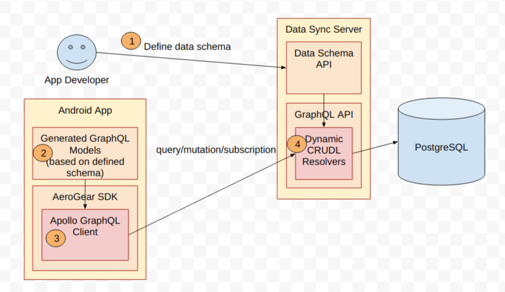

# aerogear-data-sync-server

GraphQL based data sync server for mobile, with backend integration capabilities

[](https://standardjs.com)

## Getting Started

### Install Dependencies

```
npm install
```

### Start and Initialize the Database

Use docker compose to start the database.

```
docker-compose up db
```

Initialize the database in another terminal.

```
npm run db:init
```

`npm run db:init` sets up the necessary tables and seeds the database with data useful for local development. **It is a destructive action.** It drops and recreates the tables every time.


### Start the Server

```
npm run dev
```

Go to http://localhost:8000/graphiql for an interactive query brower.
The graphql endpoint is at `/graphql`.
The subscriptions websocket is at `/subscriptions`.

### Inspecting Postgres

```
npm run db:shell
```

### Running Tests

```
npm run test
```

### Debugging Individual Tests

The easiest way to debug tests is using Chrome DevTools. Use [inspect-process](https://npm.im/inspect-process) to easily launch a debugging session with Chrome DevTools.

```
npm install -g inspect-process
```

* In chrome go to [`chrome://inspect`](chrome://inspect/)
* Click on 'Open dedicated DevTools for Node.' This will open a new DevTools window.
* Click on 'add folder to workspace' and use the wizard to open this project.
* Go to the appropriate test file (or code that's being tested) and set a breakpoint
* Now run the individual test as follows:

```
inspect node_modules/ava/profile.js some/test/file.js
```

The DevTools window should automatically connect to the debugging session and execution should pause if some breakpoints are set.

## Running on Kubernetes

TODO

## Architecture

The baseline architecture is shown below:



1. The GraphQL Data Schema, Resolvers etc.. are defined in the Data Sync Admin UI
2. All this config is deployed to the Data Sync GraphQL Server
3. The developer generates typed Models for use in their App based on the schema defined
4. The developer executes queries, mutations & subsdcriptions in their App, which uses the Apollo GraphQL client to talk to the server. The Apollo GraphQL Client is auto configured by the AeroGear SDK e.g. it knows what the Data Sync GraphQL Server url is.
5. The Data Sync GraphQL Server executes the corresponding resolvers for queries, mutations & subscriptions.
6. Configured Authentication & Autohorizatin checks are applied
7. Logging & Metrics data is gathered from the Server & connected Clients


